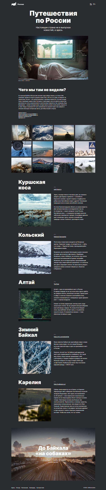

# Проект: Путешествия по России.

### Обзор проекта

Тема проекта говорит сама за себя - информационный сайт о путешествии по родной стране с соответствующими фотографиями и ссылками на некоторые сайты связанные с этой темой. А также, полезные ссылки на карты, прогноз погоды, расписание транспорта, календарь и ссылку на портал для приобретения билетов.

Проектная работы выполнялась с применением пройденных учебных материалов, связанных с версткой сайтов. Здесь упор произведен на пройденный материал по адаптивной и "резиновой" верстке.
Работа выполнялась на основе макета взятого с сервиса **figma**. Соответствие макету проводилось с помощью **PerfectPixel**.

**В процессе работы применялись следующие технологии:**
*БЭМ, flexbox-верстка, Grid Layout, подключение стилей, шрифтов, медиа-запросы, ховер-анимации на ссылках.*

**Результат выполненной проектной работы - Github Pages:** (https://sibisov-artem.github.io/russian-travel/)

**Скриншот выполненной работы:** 

